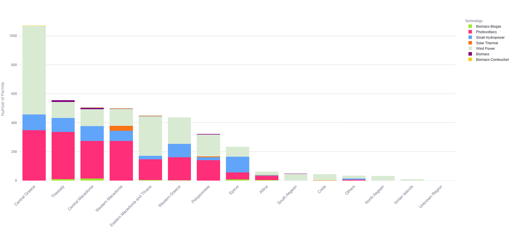
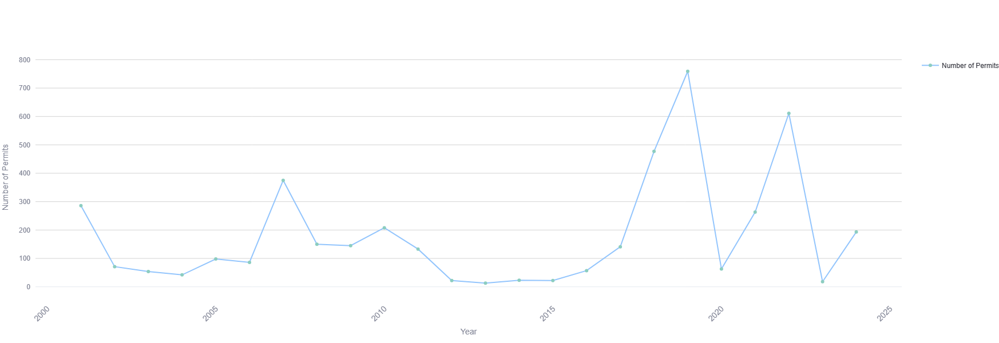
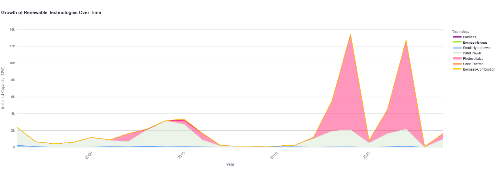
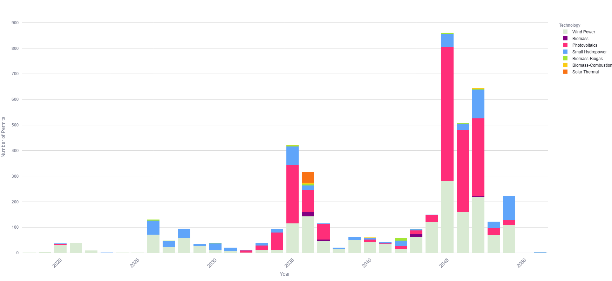

# Renewable Energy Permits Analytics – Greece  
**Interactive Visual Analytics & REST API for Renewable Energy Permit Data**

This repository provides a complete analytical framework for exploring **renewable energy permits in Greece**, including:

- Cleaned and standardized RAE permit data  
- Interactive dashboards built with **Streamlit**  
- A fully documented **REST API** with Swagger  
- Docker-ready deployment  
- Visual insights for policymakers, researchers, and energy planners  

The data was retrieved from the official RAE portal:  
https://www.raaey.gr/energeia/ape/

The visualizations produced here are also available live at:  
**[RES Market Monitor – Data Analysis](https://trineflex.csd.auth.gr/energy-actors-observatory/res-monitor/data-analysis)**

---

## Project Overview

This project analyzes renewable energy permits issued across Greece, providing insights such as:

- Regional permit distribution  
- Historical growth trends  
- Installed capacity by technology  
- Expiring permits and future renewal load  
- Technology adoption patterns  

The goal is to support **data-driven decision making** in Greece’s energy transition.

---

## Key Features

- **Streamlit dashboard** for interactive exploration  
- **REST API** for programmatic access to cleaned permit data  
- **Regional analysis** with maps and technology distributions  
- **Time-series analysis** for installed capacity & permit issuance  
- **Docker deployment** for reproducible environments  
- Clean, validated datasets ready for further analysis  

---

## Featured Visual Insights

Below are selected key plots from the Streamlit dashboard.  
*(To keep the README concise, only the most informative figures are included.)*

---

### Permit Distribution by Region

Shows how renewable energy permits are distributed across Greek regions and technologies.



---

### ** Permit Trends Over Time**

Reveals historical trends in annual permit approvals.



---

### ** Growth of Renewable Technologies**

Tracks the growth of installed capacity for each renewable technology.



---

### ** Installed Capacity by Technology**

A clear snapshot of Greece’s renewable energy mix.


---

### ** Expiring Permits Timeline**

Highlights years with large volumes of upcoming permit expirations.



---

## Architecture & Components  
| Component        | Purpose                                                       | Location                        |
|------------------|---------------------------------------------------------------|---------------------------------|
| Data Pre-processing | Download raw CSVs, cleaning, mapping regional units & technologies | `preprocess_data.py`            |
| Data Loader/API   | Load cleaned data, expose endpoints for external use          | `api/` directory                |
| Web GUI (Streamlit) | Interactive dashboards & charts powered by cleaned data       | `app.py`, `visualizations.py`   |
| Docker Setup      | Containerisation for reproducible deployment                  | `docker-compose.yml`, `Dockerfile` |
| Mapping Module    | Greek regional-unit geometry & plotting                        | `greece_map.py`                 |

---

## Getting Started (Local)  
**Prerequisites:** Docker (or Python 3.8+ with dependencies).  
```bash
git clone https://github.com/SophiaVei/Renewable-Energy-Permits-Analytics.git  
cd Renewable-Energy-Permits-Analytics  
